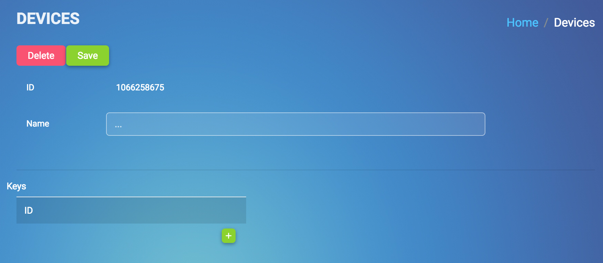
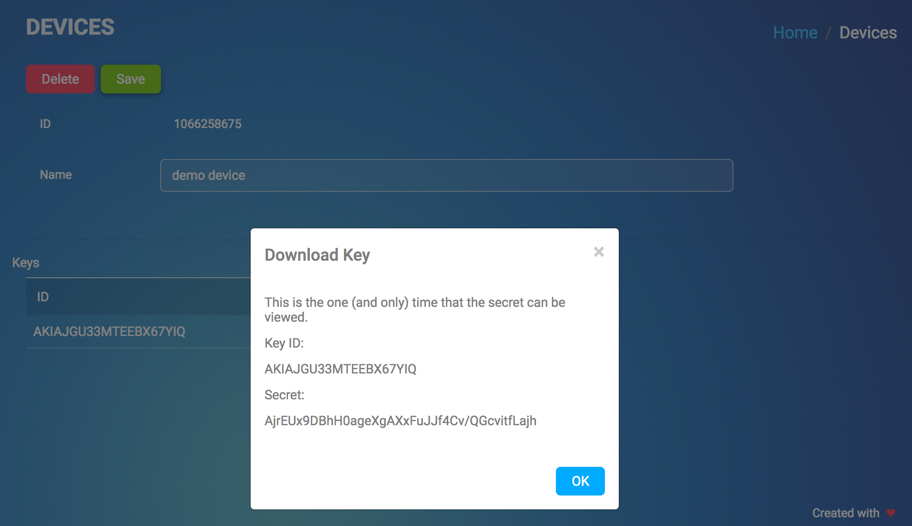
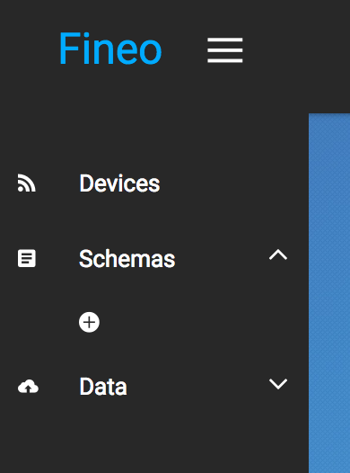
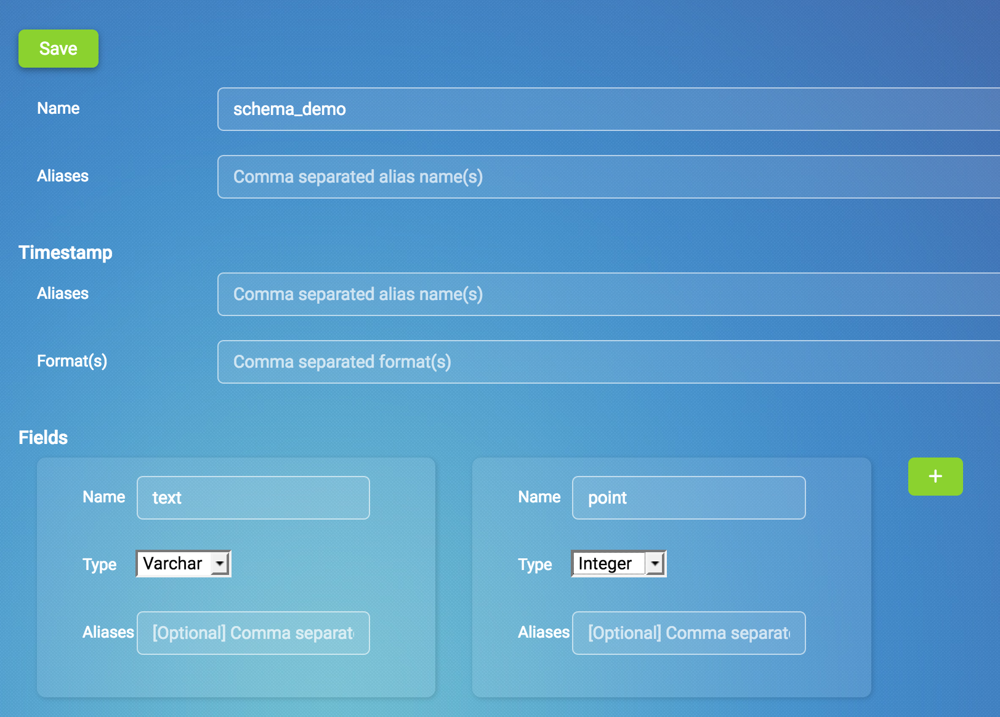
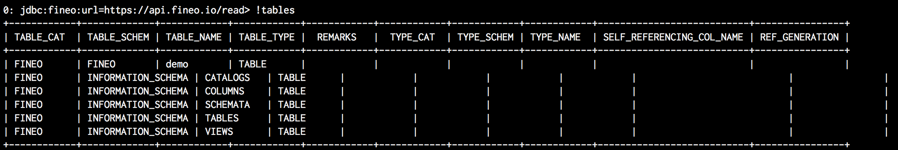
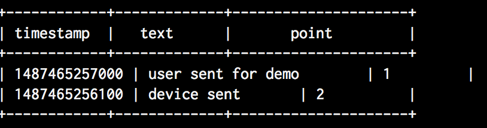

# Getting Started

Welcome to the Fineo platform! With Fineo you can easily and flexibly upload data from connected devices and then view that data through traditional SQL-based tools.

In this guide, we are going to walk through connecting a simple device, creating a schema, sending data and then reading the data back through a SQL tool.

## Creating a device

When you log in to the [web application], you are taken to the 'Devices' tab. To add a new device, you just click the '+' button to create a new device. Each device is given a unique ID.

 

Let's select the device so we can finish setting it up. First, we can set a more helpful name for
 the device and hit "Save". Then, lets add a key to the device. You can have up to two active keys for each device.

  

 When you create the key, you will be shown the device's access key and secret key. Store the secret key in a safe location - this is the only time that the secret will be accessible! If you lose the secret, you will need to create a new secret.

Now you have all the information needed to send data as that device!

## Setting up a schema

Managing schema is the other major component of any database (beyond accessing the data). While Fineo has a very flexible schema system, you still need to provide some sort of schema when sending data. You can read more about the [schema flexibility].

 

Let's create a schema by selecting the '+' button. This takes you to the schema creation page. Set the schema name, for instance 'schema_demo', and then add two fields:

 1. name: text, type: varchar
 2. name: point, type: integer

 

Then press 'save' to create the schema.

## Sending data

### With the UI

Though the application, we can also send data as the logged in user, rather than as a device. This is useful for debugging and getting started (like right now!).

Select Data -> Stream to open the upload panel. All data must be non-nested JSON and contain at least the target schema. Beyond that, data can be completely free-form and not even necessarily conform to the schema we just created (we will get to that shortly).

For now, lets just send a simple data point:

```
{
  "metrictype" : "demo",
  "text" : "user sent for demo",
  "point" : 1
}
```

### From a device

We generally recommend embedding the Fineo SDK into your application directly to help minimize latency. However, for this example, we will leverage the command line tools in the SDK to send data. [Find out more about the tools].

First, you need to [download the tools]. Then, from the command line, you can send a data point as the 'device' we created with the Stream tool:

```
$ java -cp tools-1.1.1.jar io.fineo.client.tools.Stream \
  --api-key <your api key> \
  --static-key <your device access key> \
  --static-secret <your device secret key> \
  --metric-name demo
  --field text."device sent" \
  --field point.2
```

## Reading Data

At this point, we have successfully sent two data point, one from the UI and one from a 'device'.

Naturally, you now want to read that data back!

We going to use a  standard, command line tool called SqlLine. We created a [SQLLine bundle that includes everything you need]. Once you download it, start it up with:

```
 $ tar -xf sqlline-1.1.10-fineo-1.1.tar.gz
 $ ./sqlline
```

Now, we need to connect to Fineo

```
!connect jdbc:fineo:api_key=<your api key>
```

You should have received your API Key in your welcome email (if not, [please reach out](mailto:help@fineo.io?subject=Welcome email api key help!)). 

You will then be prompted for your username and password. Enter the email and password that you used to sign up.

 Then, you can view the tables:

 ```
 0: jdbc:fineo:api_key=123> !tables
 ```

 

Or you can read the values that you sent:

```
0: jdbc:fineo:api_key=123> select * from demo;
```

 


## Flexible Schema

Up to here, this is about what you would expect from any SQL database. What get's interesting 
about Fineo is that we can leverage some 'NoSQL' like properties to help future-proof 
applications, as well as decreasing risk of changes, so you can develop quickly.

Let's suppose in moving quickly, you update the data you send from the devices, but forgot to update the schema in the database and also mis-spelled one of the new fields you are sending. Often times, you will have completely broken your application and likely your data warehousing scripts. With Fineo, we are just a button click away from fixing everything!

Lets start by sending that new data from the UI:

```
{
  "metrictype" : "demo",
  "text" : "another user event",
  "point" : 3,
  "point2" : 10,
  "pont3": 100
}
```


If you try to read the data in SQLLine you will just see the fields that you created in the schema.

Let's go and fix that schema so we can see all the new data we are sending. In the 'Schema' tab in the app, select 'demo'. Then we add the two fields that we want:

 * point2
 * point3

We also need to add an alias for ```point3``` from ```pont3``` to resolve that "mistyping" we made when sending the data.

Great! Now, when we query with SQLLine, we see:
 * the original data points
 * the new data points
 * fixed spelling on "pont3" to "point3"

## Next Steps

You now have all the tools to use the whole platform! You can create and manage devices, manipulate schemas, upload data and then view data in JDBC based tools.

When you're ready, take a deeper look into:
 * how to use the [java client SDK] in your code
 * all the power that Fineo's [schema flexibility] provides
 * all the various [command line tools]
 * how to more extensively [configure jdbc] connections

We love to hear any feedback you have, [email us]!

[web application]: https://app.fineo.io
[schema flexibility]: /schema
[download the tools]: https://maven.fineo.io/release/io/fineo/client/tools/1.1.1/tools-1.1.1.jar
[Find out more about the tools]: /client/tools
[SQLLine bundle that includes everything you need]: http://maven.fineo.io/release/sqlline/sqlline/1.1.10-fineo-1.1/sqlline-1.1.10-fineo-1.1.tar.gz
[configure jdbc]: /jdbc/intro
[command line tools]: /client/tools
[java client SDK]: /client/java
[email us]: mailto:info@fineo.io?subject=Feedback
