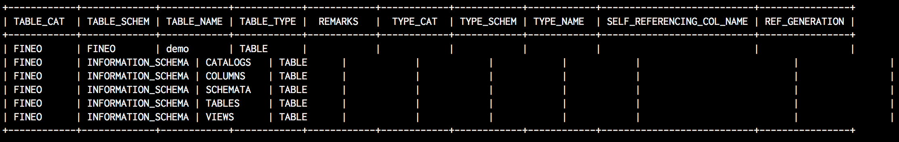

Welcome to the Fineo platform! With Fineo you can easily upload data from connected devices and then view that data through traditional SQL-based tools.

This guide is going to walk through connecting a simple device, creating a schema, sending data and then reading the data back. Then it will show to flexibly manage mistakes and how to evolve schema.

## Creating a device

The 'Devices' tab is the first screen shown when logging into the [web application]. Add a new device by clicking the '+' button. The platform will generate a unique ID for each device.

 

To finish setting up a device, enter in a name for the device and hit Save. Next add a key to the device by pressing '+’under the Keys section. You can have up to two active keys for each device.

  

When you create the key, an access key and secret key will be generated and displayed for the device. Store the secret key in a safe location - this is the only time that the secret will be accessible! If you lose the secret, you will need to create a new key.

## Setting up a schema

While Fineo has a very flexible schema system, you still need to provide some sort of schema before sending data. [Read more about schema flexibility].

To create a new schema, select Schema from the left hand navigation and then the ‘+’button in the drop down.


This takes you to the schema creation page. Set the desired schema name and fields, for instance, name the schema 'schema_demo' and add two fields:

 1. name: text, type: varchar
 2. name: point, type: integer

 

Then press Save to create the schema.

## Sending data

### With the UI

You can send data through the web application, rather than from a device. This is useful for debugging and getting started.

To open the data upload section, select Data in the left hand navigation and then select Stream from the drop down menu.


All data must be non-nested JSON and contain at least the target schema name under the field name "metrictype" [Learn how to change that field name]. Beyond that, data can be completely free-form JSON - it does not even need conform to the schema’s previously created (we will get to that shortly).

Below is an example for sending a simple data point:
```
{
  "metrictype" : "schema_demo",
  "text" : "user sent for demo",
  "point" : 1
}
```

Since this data point does not have a timestamp, one is assigned to it as the time the event is sent.

### From a device

The recommended way to send data in production is to embed the Fineo SDK into your device application. However, this example leverages the command line tools to send data like a device, rather than having to build a full application. [Learn more about how to use the SDK].

First, [download the tools] jar. Then, from the command line, send a data point as the 'device' created above using the Stream tool:

```
$ java -cp tools-1.1.3-exec.jar io.fineo.client.tools.Stream \
  --api-key <your api key> \
  --static-key <your device access key> \
  --static-secret <your device secret key> \
  --metric-name schema_demo
  --field text."device sent" \
  --field point.2
```

[Find out more about the tools]

## Reading Data

At this point, two data points have been stored - one from the UI and one from a 'device'.

Naturally, the next step is to read that data back!

Fineo provides a standard JDBC adapter that works with any JDBC-compliant SQL tool. The most simple tool is [SqlLine], a command-line based SQL interface. Fineo has created a SqlLine bundle tool that has everything you need to connected to fineo.

[Download the SqlLine bundle here].

When the download has completed unpack the tarball and start it[Find out more about using SqlLine with Fineo].

```
 $ tar -xf sqlline-1.1.10-fineo-1.2.tar.gz
 $ cd sqlline-1.1.10-fineo-1.2
 $ ./sqlline
```

Next, connect to Fineo:

```
sqlline> !connect jdbc:fineo:api_key=<your api key>
```

The Welcome Email should include the API Key to use here (if not, [please reach out](mailto:help@fineo.io?subject=Welcome email api key help!)).

SqlLine then prompts for a username and password - enter your Fineo username and password.

After successfully logging in, a simple check to ensure everything works is to check the tables:

 ```
 0: jdbc:fineo:api_key=123> !tables
 ```

 

It should include the schema created above, as well as the standard JDBC SQL tables.

Then, attempt to read all the data that was previously written:

```
0: jdbc:fineo:api_key=123> SELECT * FROM schema_demo;
```

 


## Flexible Schema

Up to here, Fineo works much like any other SQL-based time-series database. Unlike other databases, Finos also enables some 'NoSQL' like functionality to help future-proof applications, as well as decreasing risk of changes.

The easiest mistakes to make are things like forgetting to migrate the database to support a new field or misspelling a field name. Unfortunately, with conventional database management systems, this can result in data loss and/or broken features that require time consuming fixes.

Fortunately, Fineo's flexible schema support makes it as easy as clicking a button to recover that data and fix that error, without having to change your deployed application whatsoever.

Start by sending some "bad" data from the UI:

```
{
  "metrictype" : "schema_demo",
  "text" : "another user event",
  "point" : 3,
  "point2" : 10,
  "pont3": 100
}
```

This includes two fields that was not present in the 'schema_demo' schema and "pont3" is misspelled. Right now, attempting to read the data in SqlLine will just yield the known fields in the schema (e.g. `text`, `point`, and `timestamp`).


To fix this, start by opening the Schema tab in the web application and then selecting 'schema_demo'

Add the two fields:

  1. name: point2, type: integer
  2. name: point3, type: integer

An alias also needs to be added for ```point3``` to correct the ```pont3``` field sent above. Hit Save to store these changes.

Now, when querying SqlLine, all the original data points will be present, as well as the new fields and the spelling of `pont3` is transparently fixed to `point3`.

## Next Steps

You now have all the tools to use the whole platform! You can create and manage devices, manipulate schemas, upload data and then view data in JDBC based tools.

When you're ready, take a deeper look into:

 * how to use the [java client SDK] in your code
 * all the power that Fineo's [schema flexibility] provides
 * all the various [command line tools]
 * how to more extensively [configure jdbc] connections

We love to hear any feedback you have, [email us]!

[web application]: https://app.fineo.io
[Read more about schema flexibility]: /schema
[Learn how to change that field name]: /schema
[Learn more about how to use the SDK]: /client/java
[Find out more about the tools]: /client/tools
[schema flexibility]: /schema
[Find out more about using SqlLine with Fineo]: /jdbc/Using%20BI%20And%20Sql%20Tools/sqlline/
[SqlLine]: http://sqlline.sourceforge.net/
[Download the SqlLine bundle here]: http://maven.fineo.io/release/sqlline/sqlline/1.1.10-fineo-1.2/sqlline-1.1.10-fineo-1.2.tar.gz
[configure jdbc]: /jdbc/intro
[command line tools]: /client/tools
[java client SDK]: /client/java
[email us]: mailto:info@fineo.io?subject=Feedback
[download the tools]: https://maven.fineo.io/release/io/fineo/client/tools/1.1.3/tools-1.1.3-exec.jar
[latest Fineo JDBC jar]: http://maven.fineo.io/release/io/fineo/client/jdbc/1.1.3/jdbc-1.1.3-all.jar

